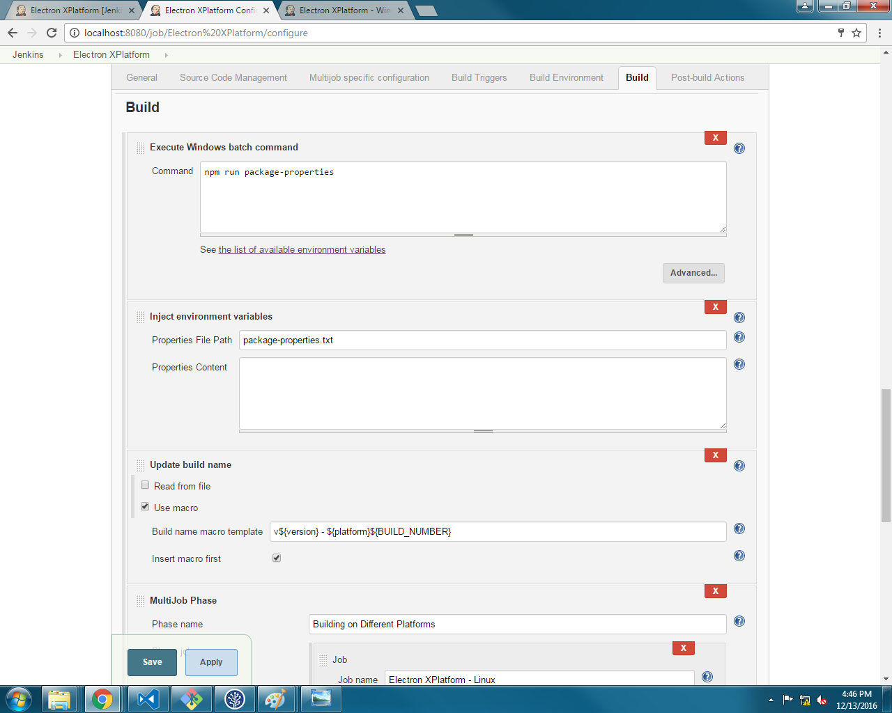
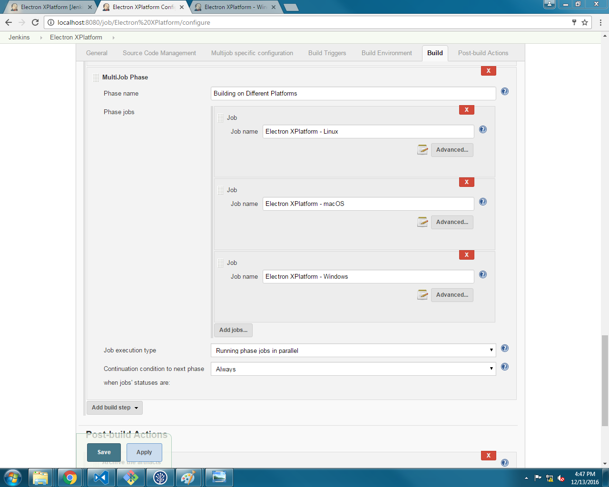
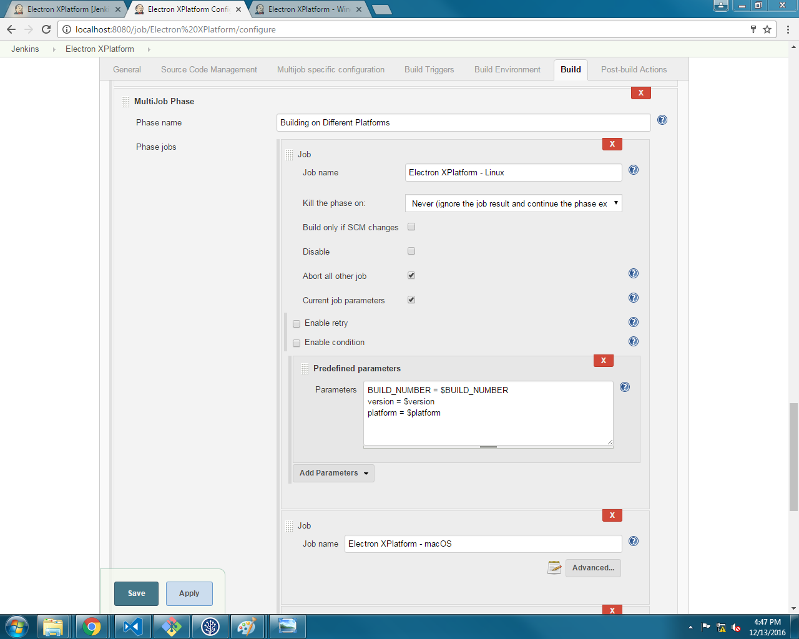
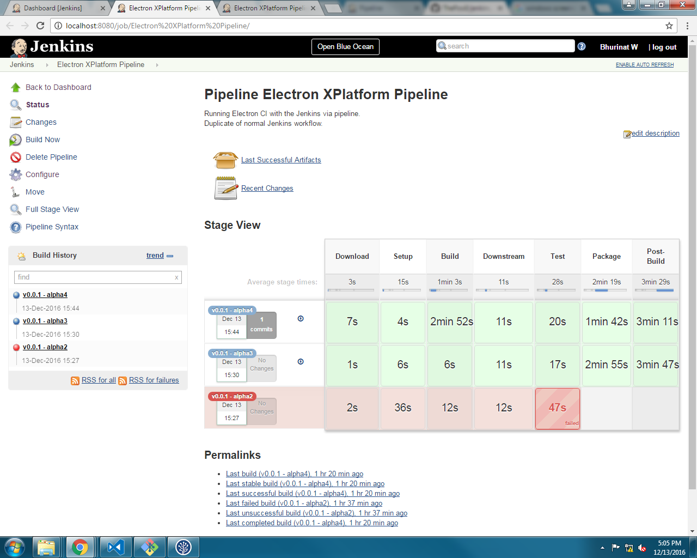
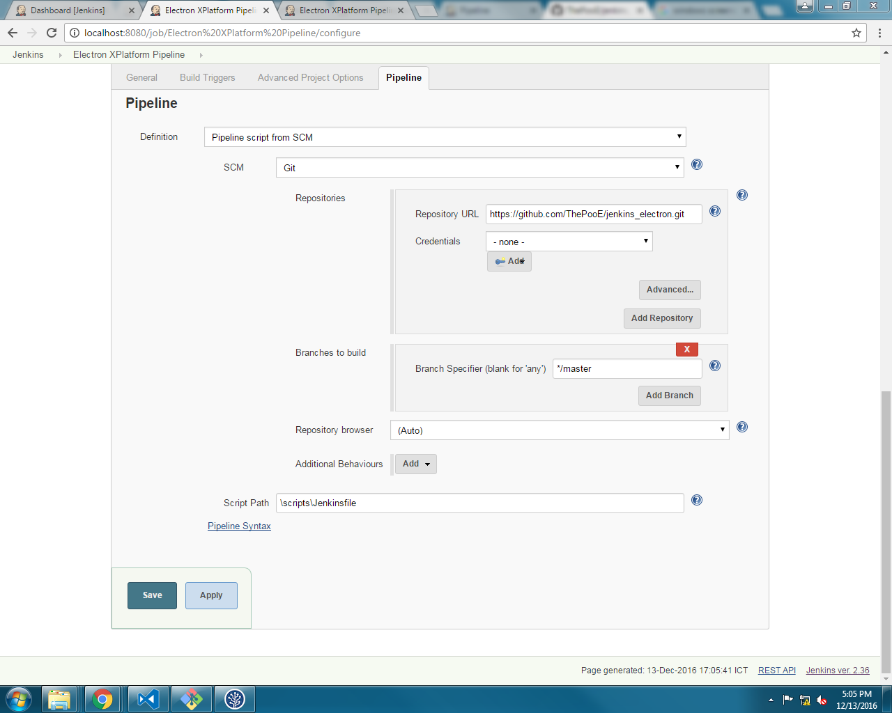
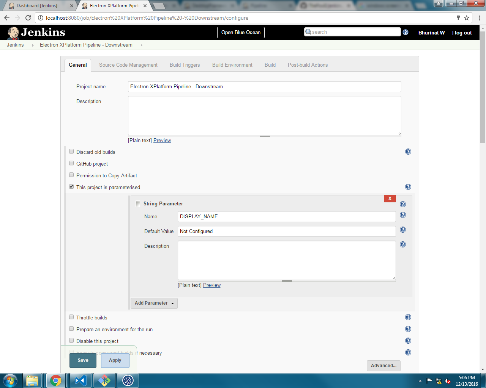
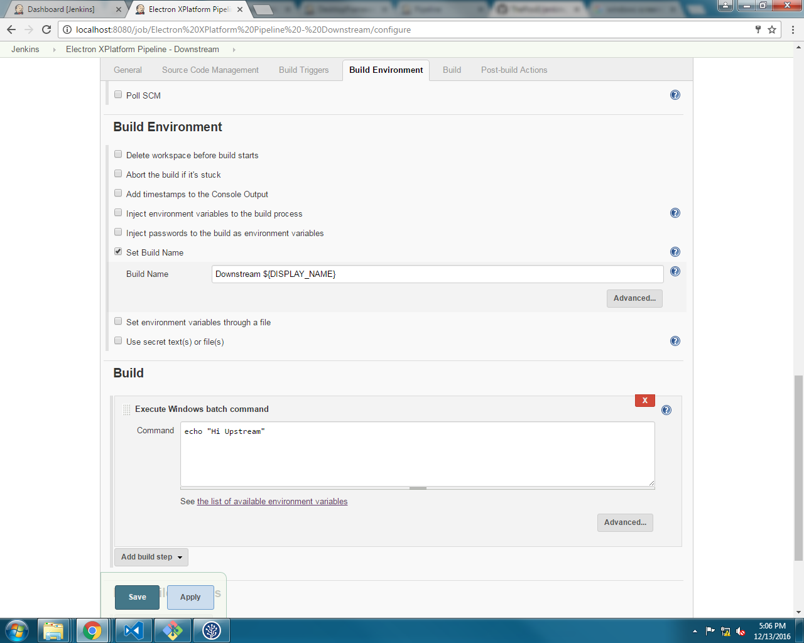

# Electron Integration with Jenkins

The main purpose of the repository was to create a Jenkins testing site on GitHub.

# Jenkins Legacy Configurations





# Jenkins Pipeline

There is a new CI method in Jenkins which has been promoted heavily. This method is called pipeline.

## Pipeline

You can read the document about Pipeline at [Jenkins](https://jenkins.io/doc/book/pipeline/)

### Key Features

- Pipeline turned the GUI interface of so called "workspace" or "jobs" into lines of code.
- Pipeline also enable version control tracking as the code itself is uploaded to the VSM.
- Enable endless extensibility: it's your mind that limits Jenkins

However there are one big problem with the pipeline issue.

### Drawbacks

Since the code was sourced from SCM, Jenkins cannot control the script file that will be run.
Thus, Jenkins enable the sandboxed on the script which disable "some" methods and restricted inputs to some limits.

- This can be avoided by approving Jenkins script in "Manage Jenkins > In-process Script Approval"

## Example

My private repository [Github](https://github.com/ThePooE/jenkins_electron) hosted the sources fle from Electron Boiler Plate

### Example Jenkinfile Script

```groovy
#!groovy
import groovy.json.*
import hudson.model.*

// Have to approve the JsonSlurperClassic signature in Jenkins
@NonCPS
def jsonParse(def json) {
    new groovy.json.JsonSlurperClassic().parseText(json)
}

node {
    /** Downloading Stage */
    stage ('Download') {
        checkout scm
        def mvnHome = tool 'M3'
    }

    /** Setting-up Stage */
    stage ('Setup') {
        bat 'npm run package-properties'
        def file = readFile 'package-properties.json'
        def json = jsonParse(file);
        currentBuild.displayName = 'v' + json.version + ' - ' + json.platform + env.BUILD_ID
        bat 'npm uninstall *'
    }

    /** Building Stage */
    stage ('Build') {
        bat 'npm install'
    }

    /** Downstreaming Stage */
    stage ('Downstream') {
        //bat "echo DISPLAYNAME=${currentBuild.displayName} > build.properties"
        build job: 'Electron XPlatform Pipeline - Downstream',
              parameters: [string(name: 'DISPLAY_NAME', value: currentBuild.displayName)]
    }

    /** Testing Stage */
    stage ('Test') {
        bat 'npm run e2e'
        bat 'npm run coverage'
    }

    /** Packaging Stage */
    stage ('Package') {
        bat 'npm run packWin'
    }

    /** Post-build Stage */
    stage ('Post-Build') {
        archiveArtifacts artifacts: '**', onlyIfSuccessful: true
        deleteDir()
    }
}
```

### Example Jenkins Setup




